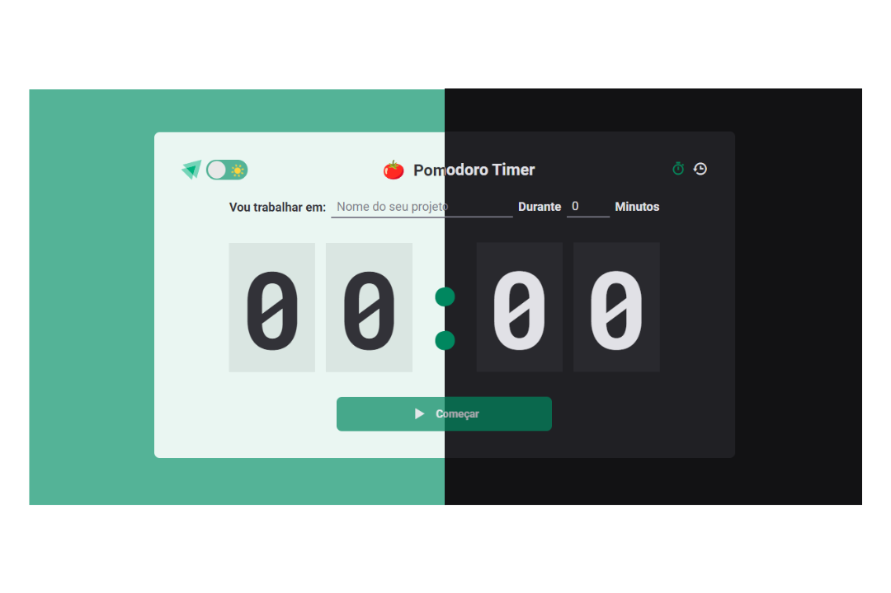
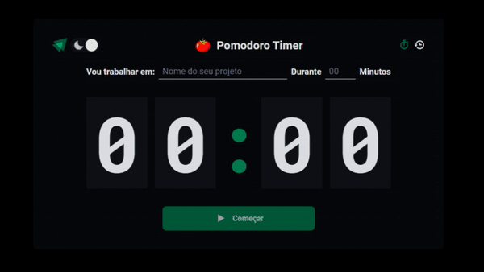

<h1 align="center">
    Pomodoro Timer
</h1>

    

O Pomodoro Timer é um projeto que tem como objetivo permitir aos usuários cronometrar suas tarefas diárias, além de fornecer um histórico completo de todas as tarefas já realizadas.

Principais Objetivos:
- Aprender a lidar com datas e horários utilizando a biblioteca date-fns.
- Utilizar formulários com React Hook Form.
- Implementar temas escuros e claros usando Styled Components.
- Utilizar o hook useReducer do React para gerenciar alterações em um estado complexo.
- Explorar outras ferramentas e tecnologias.

Se você gostou do projeto, não se esqueça de dar uma estrela ⭐ e compartilhá-lo para me ajudar. Além disso, siga-me para acompanhar outros projetos que desenvolvo.

## 📷 Demonstration

    

## Technologies

Esse projeto foi desenvolvido com as seguintes tecnologias:

✔ [Vite](https://vitejs.dev/)
 
✔ [ReactJS](https://reactjs.org/)
 
✔ [TypeScript](https://www.typescriptlang.org/)
 
✔ [Styled Components](https://styled-components.com/docs)
 
✔ [date-fns](https://date-fns.org/docs/Getting-Started)
 
✔ [React Hook Form](https://react-hook-form.com/)
 
✔ [Zod](https://github.com/colinhacks/zod)
 
✔ [React Router](https://reactrouter.com/en/v6.3.0/getting-started/overview)
 
✔ [Immer](https://github.com/immerjs/immer)
 

## Getting Started

Clique no link a seguir para executar o projeto na sua máquina:

### Prerequisites

Antes de baixar o projeto você vai precisar ter instalado na sua máquina as seguintes ferramentas:

* [Git](https://git-scm.com)
* [NodeJS](https://nodejs.org/en/)
* [Yarn](https://yarnpkg.com/) ou [NPM](https://www.npmjs.com/)

### Installation

Segue os comandos para baixar e executar o projeto na sua máquina:

* `git clone` + `URL do Projeto`: clonar este repositório;
* `npm i` para baixar as dependências do projeto;
* `npm run dev` roda o projeto em sua máquina.

## Author

    Made by DJeanS03

    
    

